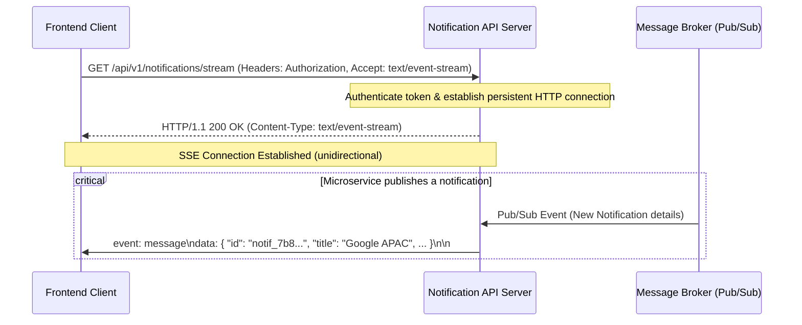
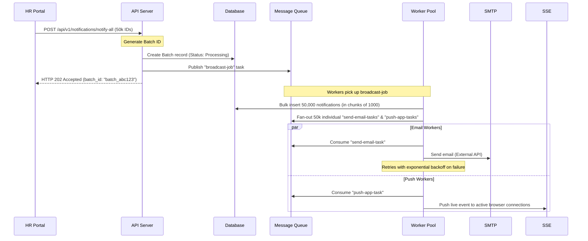
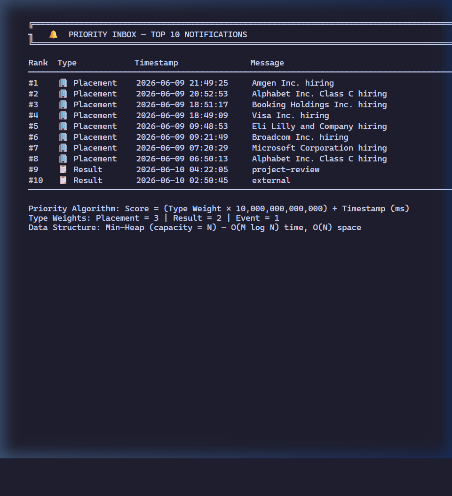
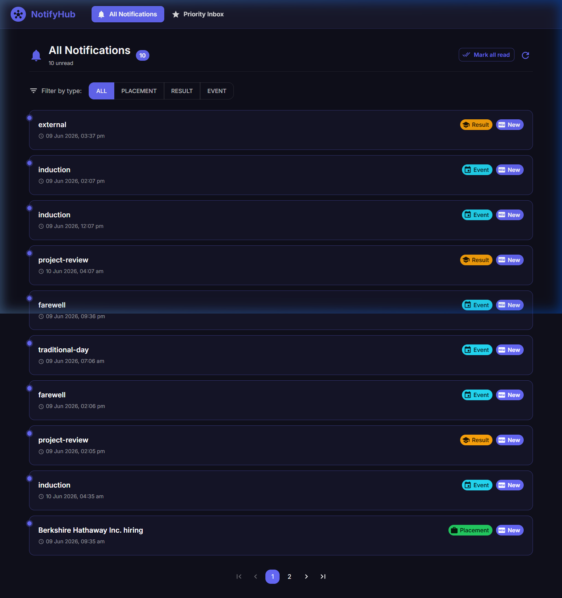
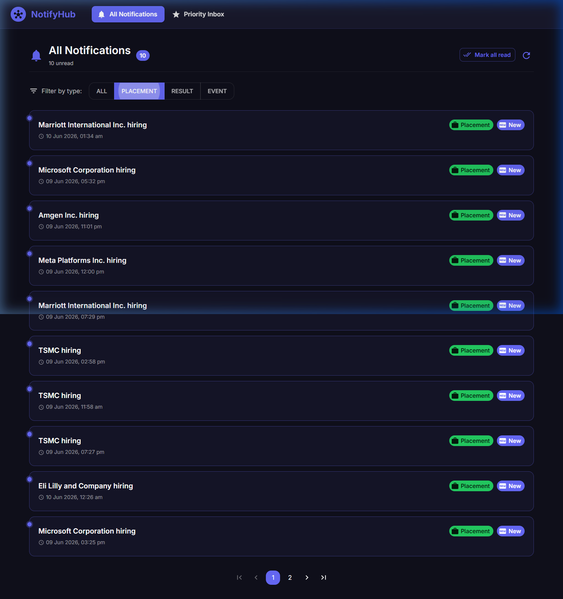
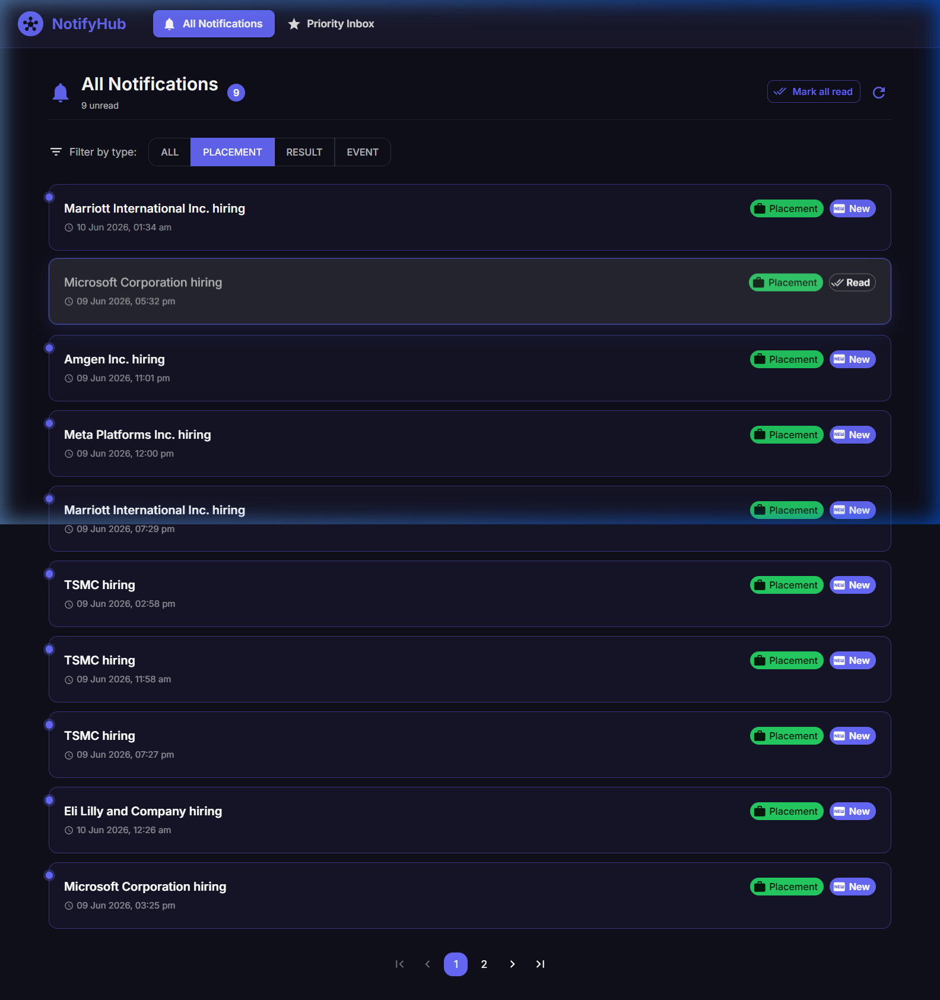
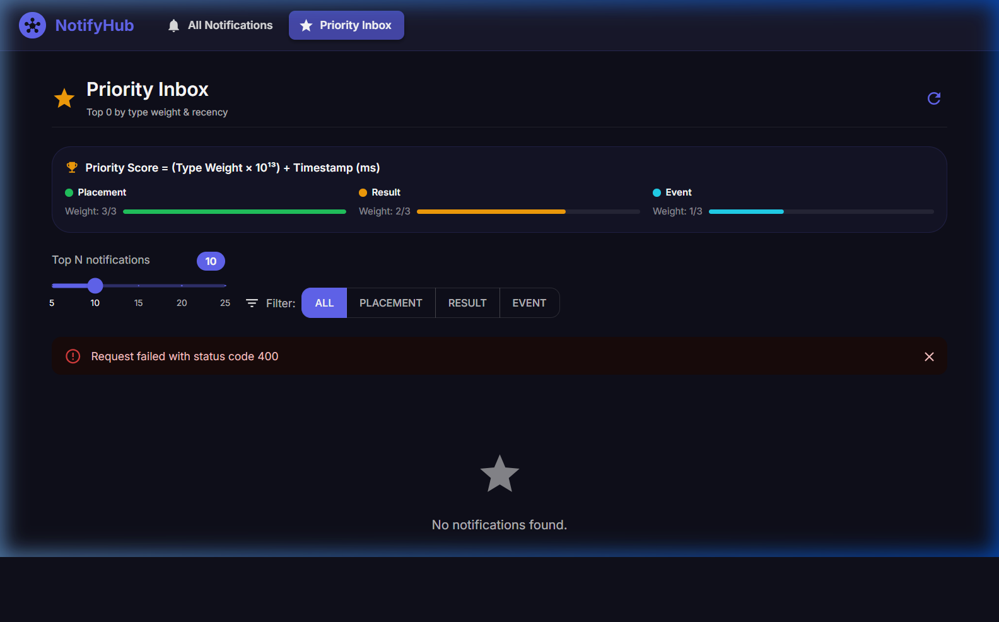
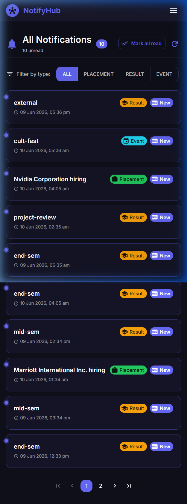
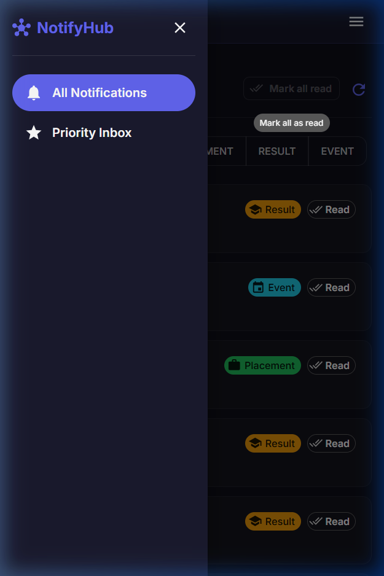
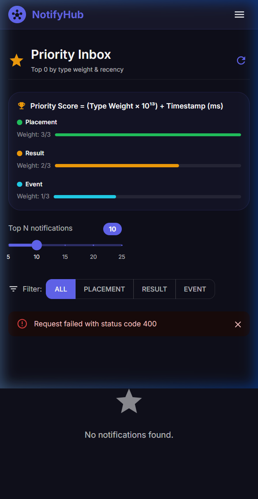

# Stage 1: Notification System API & Real-Time Design

This document details the REST API contract, JSON schema structures, and real-time delivery mechanism for the Notification Platform.

---

## 1. REST API Endpoints Overview

The API is structured around RESTful resources under version control (`/api/v1`). All responses follow a standardized envelope structure.

| Method | Endpoint | Description | Auth Required |
|:---|:---|:---|:---|
| **POST** | `/api/v1/notifications` | Send/publish a new notification to a specific user. | Yes |
| **GET** | `/api/v1/notifications` | Retrieve a list of notifications for the authenticated user. | Yes |
| **PATCH** | `/api/v1/notifications/:id/status` | Mark a specific notification as read or unread. | Yes |
| **DELETE** | `/api/v1/notifications/:id` | Dismiss/delete a notification. | Yes |

---

## 2. API Contracts & Specifications

### 2.1 Send Notification (`POST /api/v1/notifications`)
Used by internal systems and microservices to send a notification to a specific recipient.

#### Headers
```http
Content-Type: application/json
Authorization: Bearer <access_token>
```

#### JSON Request Body
```json
{
  "recipientId": "usr_94a7e2b1",
  "title": "Placement Drive: Google APAC 2026",
  "message": "Applications are now open for the Software Engineer role. Deadline: June 30.",
  "type": "Placement",
  "priority": "high",
  "metadata": {
    "jobId": "job_google_001",
    "applyUrl": "https://careers.google.com"
  }
}
```

#### JSON Response (Success - `201 Created`)
```json
{
  "success": true,
  "data": {
    "id": "notif_7b8c2d91",
    "recipientId": "usr_94a7e2b1",
    "title": "Placement Drive: Google APAC 2026",
    "message": "Applications are now open for the Software Engineer role. Deadline: June 30.",
    "type": "Placement",
    "priority": "high",
    "status": "unread",
    "metadata": {
      "jobId": "job_google_001",
      "applyUrl": "https://careers.google.com"
    },
    "timestamp": "2026-06-10T05:30:00Z"
  }
}
```

#### JSON Response (Error - `400 Bad Request`)
```json
{
  "success": false,
  "error": {
    "code": "VALIDATION_FAILED",
    "message": "Invalid fields present in the request body.",
    "details": [
      {
        "field": "type",
        "issue": "Must be one of: Placement, Result, Event"
      }
    ]
  }
}
```

---

### 2.2 Retrieve Notifications (`GET /api/v1/notifications`)
Retrieves notifications for the authenticated user. Supports filtering by notification type, read status, and cursor-based pagination.

#### Headers
```http
Accept: application/json
Authorization: Bearer <access_token>
```

#### Query Parameters
- `limit` (integer, default: 10): Number of notifications to return.
- `type` (string, optional): Filter by notification category (`Placement`, `Result`, `Event`).
- `status` (string, optional): Filter by status (`read`, `unread`).
- `cursor` (string, optional): Unique ID for pagination anchor.

#### JSON Response (Success - `200 OK`)
```json
{
  "success": true,
  "data": {
    "notifications": [
      {
        "id": "notif_7b8c2d91",
        "title": "Placement Drive: Google APAC 2026",
        "message": "Applications are now open for the Software Engineer role. Deadline: June 30.",
        "type": "Placement",
        "priority": "high",
        "status": "unread",
        "metadata": {
          "jobId": "job_google_001",
          "applyUrl": "https://careers.google.com"
        },
        "timestamp": "2026-06-10T05:30:00Z"
      }
    ],
    "pagination": {
      "limit": 1,
      "nextCursor": "notif_7b8c2d91",
      "hasMore": false
    }
  }
}
```

---

### 2.3 Update Notification Status (`PATCH /api/v1/notifications/:id/status`)
Updates the status of a specific notification (e.g., marking it as read).

#### Headers
```http
Content-Type: application/json
Authorization: Bearer <access_token>
```

#### JSON Request Body
```json
{
  "status": "read"
}
```

#### JSON Response (Success - `200 OK`)
```json
{
  "success": true,
  "data": {
    "id": "notif_7b8c2d91",
    "status": "read",
    "updatedAt": "2026-06-10T05:32:15Z"
  }
}
```

---

### 2.4 Delete Notification (`DELETE /api/v1/notifications/:id`)
Dismisses and permanently deletes a specific notification.

#### Headers
```http
Authorization: Bearer <access_token>
```

#### JSON Response (Success - `200 OK`)
```json
{
  "success": true,
  "message": "Notification successfully dismissed."
}
```

---

## 3. JSON Schemas & Validation

### 3.1 Notification Object Schema
```json
{
  "$schema": "https://json-schema.org/draft/2020-12/schema",
  "title": "Notification",
  "type": "object",
  "required": ["id", "recipientId", "title", "message", "type", "priority", "status", "timestamp"],
  "properties": {
    "id": {
      "type": "string",
      "description": "Unique identifier of the notification"
    },
    "recipientId": {
      "type": "string",
      "description": "Identifier of the target user"
    },
    "title": {
      "type": "string",
      "maxLength": 100,
      "description": "Short heading of the notification"
    },
    "message": {
      "type": "string",
      "maxLength": 1000,
      "description": "Main body text of the notification"
    },
    "type": {
      "type": "string",
      "enum": ["Placement", "Result", "Event"],
      "description": "Category of the notification"
    },
    "priority": {
      "type": "string",
      "enum": ["low", "medium", "high"],
      "description": "Urgency levels used for client rendering order"
    },
    "status": {
      "type": "string",
      "enum": ["read", "unread"],
      "description": "Current read status of the notification"
    },
    "metadata": {
      "type": "object",
      "description": "Dynamic structural payload containing extra links or contextual items"
    },
    "timestamp": {
      "type": "string",
      "format": "date-time",
      "description": "ISO 8601 UTC timestamp of creation"
    }
  }
}
```

---

## 4. Real-Time Notification Mechanism

To deliver real-time notifications to connected clients with high efficiency and minimal latency, the system utilizes **Server-Sent Events (SSE)**.



### 4.1 Server-Sent Events (SSE) Specification
Clients initiate a persistent connection through a standard HTTP request:

#### Request
```http
GET /api/v1/notifications/stream
Accept: text/event-stream
Cache-Control: no-cache
Connection: keep-alive
Authorization: Bearer <access_token>
```

#### Response Headers
```http
HTTP/1.1 200 OK
Content-Type: text/event-stream
Cache-Control: no-cache
Connection: keep-alive
Access-Control-Allow-Origin: *
```

#### Event Data Format
When a notification triggers, the server pushes a message over the connection:
```text
event: notification
data: {"id":"notif_7b8c2d91","title":"Placement Drive: Google APAC 2026","message":"Applications are now open.","type":"Placement","priority":"high","timestamp":"2026-06-10T05:30:00Z"}

event: heartbeat
data: {"time":"2026-06-10T05:31:00Z"}
```

### 4.2 Why Server-Sent Events (SSE) was Chosen Over WebSockets
1. **Unidirectional Simplicity**: Notifications flow purely from server-to-client. SSE is explicitly built for unidirectional streaming, avoiding the overhead of managing a full-duplex WebSocket connection.
2. **Standard HTTP Compatibility**: SSE operates over standard HTTP/HTTPS protocols, making it transparent to firewalls, API gateways, load balancers, and reverse proxies.
3. **Automatic Reconnection**: Browsers natively handle connection drops for SSE (`EventSource` API) and auto-reconnect with backoff. With WebSockets, this retry logic must be manually written.
4. **Multiplexing Support**: Over HTTP/2, SSE connections are multiplexed over a single TCP socket connection, mitigating the 6-connection browser limit per domain.

---

# Stage 2: Database Design, Schema, and Queries (MongoDB)

This section describes the persistent storage strategy using MongoDB, document schema definition, scaling considerations, and implementation queries for the notification platform.

---

## 1. Database Selection & Justification

To store notifications reliably under high write volumes and varying query patterns, we recommend **MongoDB** (NoSQL Document Database).

### Why MongoDB is Recommended:
1. **Native Dynamic Payload Support**: Notifications are polymorphic (dynamic) by nature. For instance, a `Placement` notification might contain `jobId` and `applyUrl` inside its metadata, whereas a `Result` notification might contain `examId` and `subject`. MongoDB's BSON document structure natively supports dynamic schemas without serialization/deserialization overhead.
2. **Native Time-to-Live (TTL) Indexes**: Notifications are transient. Rather than implementing database locks or complex range partitions to prune old notifications, MongoDB allows you to create a native TTL index on the `createdAt` field to automatically prune documents older than a specified duration (e.g., 90 days) in the background.
3. **High Write Throughput**: The WiredTiger storage engine uses document-level concurrency and lock-free algorithms, allowing the system to handle massive write spikes (e.g., sending a notification to all users simultaneously) efficiently.
4. **Horizontal Scaling via Sharding**: Since notification access patterns are partitioned per user, sharding the database by `recipientId` allows horizontal scalability across multiple machines, keeping active indexes fully resident in memory.

---

## 2. Database Schema & Index Design

Below is the document schema representation and indexing strategies designed for MongoDB.

### 2.1 Sample Document Schema
```json
{
  "_id": { "$oid": "60b8d3f1f1d2a84a6c8b4567" },
  "recipientId": "usr_94a7e2b1",
  "title": "Placement Drive: Google APAC 2026",
  "message": "Applications are now open for the Software Engineer role. Deadline: June 30.",
  "type": "Placement",
  "priority": "high",
  "status": "unread",
  "metadata": {
    "jobId": "job_google_001",
    "applyUrl": "https://careers.google.com"
  },
  "createdAt": { "$date": "2026-06-10T05:30:00Z" },
  "updatedAt": { "$date": "2026-06-10T05:30:00Z" }
}
```

### 2.2 Performance Optimization Indexes
We define compound indexes to optimize user inbox reads and a TTL index to prune old records.

```javascript
// 1. Compound Index for user inbox queries (fetch user notifications sorted by newest first)
db.notifications.createIndex({ recipientId: 1, status: 1, createdAt: -1 });

// 2. Compound Index for user inbox filtered by category/type
db.notifications.createIndex({ recipientId: 1, type: 1, createdAt: -1 });

// 3. TTL Index to automatically delete notification documents after 90 days (7,776,000 seconds)
db.notifications.createIndex({ "createdAt": 1 }, { expireAfterSeconds: 7776000 });
```

---

## 3. Scalability Challenges & Solutions

As data volume grows to millions of notifications daily, several bottlenecks can arise.

### 3.1 Anticipated Problems:
1. **Working Set Exceeds RAM**: Index size grows larger than the available physical RAM. This causes index lookups to fetch pages from disk, leading to severe latency degradation.
2. **Large collection scans**: If indexes are not utilized properly, fetching user feeds would result in slow scans of millions of documents.
3. **Write Bottlenecks**: A single primary node will bottleneck under concurrent write loads during mass notifications.

### 3.2 Mitigation Solutions:
1. **Horizontal Sharding**: Partition the collection across multiple shards. Selecting `recipientId` as the shard key ensures that all read and write queries for a given user map to a single shard, keeping data locally indexed.
2. **Caching Strategy (Redis)**: Store user unread counts in Redis (e.g., hash keys `user:{id}:unread_count`). When a notification is created, increment the counter. When a notification is read, decrement it. The frontend reads the badge count directly from Redis instead of querying the database.
3. **Index Optimization**: Use index coverage to prevent loading documents from disk when executing count queries (e.g., retrieving only count of unread notifications using the compound index).

---

## 4. REST API Implementation Queries

Below are the MongoDB Shell / Mongoose queries mapped to each REST API endpoint designed in Stage 1.

### 4.1 Create Notification (`POST /api/v1/notifications`)
Inserts a new notification document.
```javascript
db.notifications.insertOne({
  recipientId: "usr_94a7e2b1",
  title: "Placement Drive: Google APAC 2026",
  message: "Applications are now open for the Software Engineer role. Deadline: June 30.",
  type: "Placement",
  priority: "high",
  status: "unread",
  metadata: {
    jobId: "job_google_001",
    applyUrl: "https://careers.google.com"
  },
  createdAt: new Date(),
  updatedAt: new Date()
});
```

### 4.2 Fetch Notifications with Filters and Keyset Pagination (`GET /api/v1/notifications`)
Retrieves notifications matching filters. Uses keyset pagination (cursor using `createdAt` timestamp) for efficient scanning.

**Query (Example: Fetch latest 10 unread "Placement" notifications for user `usr_94a7e2b1` before a specific timestamp cursor):**
```javascript
db.notifications.find({
  recipientId: "usr_94a7e2b1",
  type: "Placement",                  // Optional filter
  status: "unread",                    // Optional filter
  createdAt: { $lt: ISODate("2026-06-10T05:30:00Z") } // Keyset pagination cursor
})
.sort({ createdAt: -1 })
.limit(10);
```

### 4.3 Update Notification Status (`PATCH /api/v1/notifications/:id/status`)
Updates the status of a specific notification.
```javascript
db.notifications.updateOne(
  { _id: ObjectId("60b8d3f1f1d2a84a6c8b4567") },
  { 
    $set: { 
      status: "read", 
      updatedAt: new Date() 
    } 
  }
);
```

### 4.4 Delete Notification (`DELETE /api/v1/notifications/:id`)
Permanently deletes a notification.
```javascript
db.notifications.deleteOne({
  _id: ObjectId("60b8d3f1f1d2a84a6c8b4567")
});
```

---

# Stage 3: Query Optimization and Database Tuning

This section answers the performance audit questions regarding query execution, indexing strategies, and database scalability.

---

## 1. Query Analysis & Performance Audit

The developer's original query to fetch unread notifications for a student is:
```sql
SELECT * FROM notifications
WHERE studentID = 1042 AND isRead = false
ORDER BY createdAt ASC;
```

### 1.1 Is this query accurate?
* **Syntactic Correctness**: Yes, the query is syntactically correct SQL.
* **Accuracy Details**:
  * **Implicit Type Casting Hazard**: If `studentID` is stored as a string (`VARCHAR`, `UUID`) in the schema, passing a numeric literal (`1042`) forces the database engine to cast the column values to numbers on the fly. This disables index lookups, forcing a full table scan. The query should explicitly pass a string parameter if the schema defines it as such (e.g., `studentID = '1042'`).
  * **Unnecessary Overhead (`SELECT *`)**: Using `SELECT *` retrieves all columns, including large payload columns (`message`, `metadata`). This consumes significant network bandwidth and prevents the database from performing **Index-Only Scans**.
  * **Chronological Sorting**: `ORDER BY createdAt ASC` displays notifications from oldest-first. Standard notification feeds show newest-first (`DESC`), though this is acceptable if the application design requires oldest-first queues.

---

## 2. Diagnostics: Why is the query slow?

With **5,000,000 notifications** and **50,000 students**, the query slows down due to two main database operations:

1. **Full Table Scan (Sequential Scan)**:
   Without an index containing `studentID`, the database engine must read all **5,000,000 rows** from disk/buffer pool into memory to identify the records matching `studentID = 1042` and `isRead = false`.
2. **External Sorting (Filesort Overhead)**:
   The database engine must sort the filtered records by `createdAt ASC`. Since there is no index storing data in this pre-sorted order, the database must perform an in-memory sort. If the matching records exceed the database's sort memory configuration (e.g., `work_mem` in PostgreSQL), the engine writes temporary files to disk to perform a merge sort, causing a huge performance hit.

---

## 3. Recommended Changes and Computation Cost

### 3.1 What to Change
1. **Create a Composite Index**:
   Create a multi-column index covering the search filters and the sort column:
   ```sql
   CREATE INDEX idx_notifications_student_unread_created 
   ON notifications (studentID, isRead, createdAt ASC);
   ```
2. **Select Only Required Fields**:
   Avoid `SELECT *` and fetch only necessary fields:
   ```sql
   SELECT id, title, message, notificationType, createdAt 
   FROM notifications
   WHERE studentID = 1042 AND isRead = false
   ORDER BY createdAt ASC;
   ```

### 3.2 Computation Cost Comparison
* **Before optimization**: 
  * **Time Complexity**: $O(N)$ where $N = 5,000,000$ (Full Table Scan) + $O(M \log M)$ sorting cost where $M$ is the number of notifications for the student.
  * **Resource Usage**: High disk I/O to read 5,000,000 rows, high CPU usage for merge sorting.
* **After optimization**:
  * **Time Complexity**: $O(\log N + K)$ where $K$ is the number of unread notifications for that student (usually $K < 20$). B-tree index traversal takes logarithmic time.
  * **Resource Usage**: Instantaneous retrieval requiring reading only a few index pages (typically already cached in memory). Sorting cost becomes $O(1)$ because B-tree index leaf nodes store data pre-sorted.

---

## 4. Evaluation of "Index on Every Column" Strategy

The suggestion to add indexes on every single column **is not effective and is highly discouraged in production systems.**

### Why this strategy fails:
1. **Write Overhead**: Every write transaction (`INSERT`, `UPDATE`, `DELETE`) must update all corresponding column indexes. Indexing every column slows down data ingestion and status updates.
2. **Storage and RAM Bloat**: Indexes consume disk space and, more importantly, must reside in RAM for optimal query performance. Indexing every column bloats the index volume, pushing active data out of the RAM buffer cache and slowing down the entire database.
3. **Inability to Solve Multi-Column Queries**: A query with `WHERE studentID = 1042 AND isRead = false` cannot utilize two separate single-column indexes effectively (index-merge is resource-intensive). It requires a single **Composite Index** on both columns.
4. **Planner Confusion**: Having too many single-column indexes can cause the query optimizer to miscalculate costs and select sub-optimal execution paths.

---

## 5. Fetching Placement Notifications in the Last 7 Days

To find all unique students who received a `Placement` notification in the last 7 days, use the following optimized query:

### SQL Query
```sql
SELECT DISTINCT studentID
FROM notifications
WHERE notificationType = 'Placement'
  AND createdAt >= NOW() - INTERVAL '7 days';
```
*(Note: Use `NOW() - INTERVAL 7 DAY` for MySQL/MariaDB syntax, or standard `CURRENT_DATE - INTERVAL '7 days'` for PostgreSQL)*.

---

# Stage 4: Database Overload Mitigation & Caching Strategies

Fetching notifications on every single page load for every student creates an $O(N)$ query load relative to user page transitions, leading to DB exhaustion. Below are four concrete strategies to eliminate this performance bottleneck, along with their architecture and trade-offs.

---

## 1. Suggested Strategies to Improve Performance

### Strategy 1: Server-Side Caching (Cache-Aside Pattern with Redis)
Instead of querying the primary database on every page load, check an in-memory cache (**Redis**) first.
* **How it works**:
  * **Read Path**: The API server checks Redis for `user:{studentID}:notifications`. If present (Cache Hit), it returns the data immediately. If missing (Cache Miss), it queries the database, populates Redis with a Time-To-Live (TTL) of e.g. 15 minutes, and returns the response.
  * **Write/Update Path**: When a new notification is created or updated, invalidate (delete) the user's cache key in Redis so that the subsequent read fetches fresh data from the DB (Write-Through or Cache Invalidation).

### Strategy 2: Pull-to-Push Migration (Stateful Client Connection)
Shift from a "pull-based" model (restless HTTP GET queries on page load) to a "push-based" model using **Server-Sent Events (SSE)** or **WebSockets**.
* **How it works**:
  * The frontend client fetches the active notification list **only once** upon the initial session boot (initial page load).
  * The client then establishes a persistent, stateful SSE connection (`GET /api/v1/notifications/stream`).
  * As long as the user navigates the app (Single Page Application routing), the frontend uses the local memory state (e.g., Redux, Vuex, Context). When a new notification is pushed via SSE, the frontend appends it to the in-memory array. The database is never queried again during that session.

### Strategy 3: Client-Side Caching & Stale-While-Revalidate (SWR)
Use client-side data fetching libraries (like `React Query`, `SWR`, or HTTP `ETags`) to cache responses in the browser.
* **How it works**:
  * Utilize the **Stale-While-Revalidate** pattern. When a user navigates to a new page, the client displays the cached notifications instantly (excellent UX) and fires a background fetch to verify updates only if the cache age exceeds a threshold (e.g., 60 seconds).
  * Set HTTP cache headers: `Cache-Control: private, max-age=60`.

### Strategy 4: Read/Write Split (Database Read Replicas)
Offload read queries from the primary database to read-only replica instances.
* **How it works**:
  * Set up one primary database instance for writes (`INSERT`, `UPDATE`, `DELETE`) and configure two or more read replicas.
  * Configure the API routing logic to send `POST`, `PATCH`, and `DELETE` requests to the primary DB, and all `GET` notifications requests to the read replica pool.

---

## 2. In-Depth Trade-Off Analysis

| Strategy | Advantages | Disadvantages & Trade-offs |
|:---|:---|:---|
| **Redis Caching** (Server-Side) | • Sub-millisecond response times.<br>• Drastically reduces CPU and I/O load on the primary DB.<br>• Highly predictable performance. | • **Cache Invalidation Complexity**: Ensuring the cache is deleted when a user reads a notification is critical. Failures in invalidation lead to stale counts.<br>• **Cost**: RAM is more expensive than SSD storage. |
| **Real-Time Push** (SSE/WebSockets) | • Zero DB load for notifications on subsequent page views.<br>• Live, instant notifications (superior UX).<br>• No polling intervals needed. | • **Connection Management**: Maintaining 50,000 active TCP connections requires robust load balancers and resource-rich API servers.<br>• **Reconnection Storms**: If the server drops, 50,000 clients attempting to reconnect simultaneously can trigger a DDOS-like spike on the servers. |
| **Client-Side Caching** (SWR/HTTP) | • Zero server load for repeated views within the TTL.<br>• Trivial to implement; requires no backend infrastructure changes. | • **Delayed Visibility**: Users might experience a delay of up to the TTL (e.g., 60 seconds) in seeing a new notification unless forced refresh is triggered.<br>• **Multi-Tab Sync**: Multiple open tabs might show out-of-sync unread counts. |
| **Read Replicas** | • Easily scales reads horizontally by adding more replica nodes.<br>• No change to application caching logic needed.<br>• High availability (failover support). | • **Replication Lag**: A notification written to the primary may take a few milliseconds/seconds to sync to the replicas. If a user refreshes immediately, they might not see the new notification (temporary inconsistency). |

---

## 3. Recommended Hybrid Solution

For the best cost-to-performance ratio, we recommend a **hybrid approach**:
1. **Initial load SWR**: Fetch the notifications list from the backend using client-side **SWR** (caching in-browser for 60 seconds) to prevent routing changes from hitting the backend.
2. **Server-Side Cache**: Service all API fetches through a **Redis cache** (Cache-Aside pattern) to ensure that when the database is queried, it is fetched from memory.
3. **Real-time Event updates**: Stream new notifications via **SSE**. When a message is received on the client, update the local memory state and increment the count locally, completely bypassing database reads.

---

# Stage 5: Reliable High-Volume Messaging & Asynchronous Architecture

This section reviews the synchronous "Notify All" implementation for 50,000 users, analyzes the partial email delivery failure, decouples database transactions from third-party APIs, and details an asynchronous system design.

---

## 1. Analysis of Current Shortcomings

The proposed implementation runs a synchronous loop over 50,000 students:
```python
function notify_all(student_ids: array, message: string):
    for student_id in student_ids:
        send_email(student_id, message)
        save_to_db(student_id, message)
        push_to_app(student_id, message)
```

### 1.1 Shortcomings Identified:
1. **Request Timeout / Thread Blocking**: 
   Sending an email via an external API takes roughly 100ms–300ms. If processing each student takes 200ms, notifying 50,000 students takes $50,000 \times 200\text{ms} = 10,000\text{ seconds}$ (~2.7 hours). The web server handling the request will long timeout, and the HTTP request thread will block, leading to server exhaustion.
2. **Lack of Fault Isolation**:
   If `send_email` throws an exception for student #10,000 (e.g. invalid email format), the entire function crashes. Students #10,001 to #50,000 will never receive their notifications.
3. **No Transaction Tracking or Idempotency**:
   If the script crashes midway, there is no state indicating who received the notification. Rerunning the script will duplicate emails/notifications for the users who successfully completed before the crash.
4. **Third-Party Rate Limits**:
   Making 50,000 sequential HTTP requests to an email provider (like SendGrid or AWS SES) will trigger rate limits (HTTP 429), leading to mass failures.
5. **Database Connection Pool Exhaustion**:
   Opening and closing 50,000 individual insert queries sequentially is highly inefficient and creates long-running transaction locks.

---

## 2. Handling the 200 Failed Emails Midway

In the original implementation, when `send_email` fails for 200 students midway, the system crashes or leaves these 200 users in an inconsistent state (they might have received the in-app push but not the email). 

### How to resolve this in a production system:
1. **Decoupled Job State**: Track each recipient's delivery status (`pending`, `sent`, `failed`) in a batch table.
2. **Individual Task Queues**: Run email delivery as independent async tasks. A failure in one task does not affect other tasks.
3. **Dead Letter Queue (DLQ)**: If an email fails repeatedly, move it to a DLQ for manual analysis (e.g., checking for invalid addresses), without halting the system.

---

## 3. Decoupling Database Inserts and Email Sending

### Should database saves and email delivery happen together synchronously?
**No, they must be completely decoupled.**

* **Why?**
  * **System Latency Differences**: A database write is local and takes $<2\text{ms}$. An email call goes over the public internet to a third-party server, taking $>200\text{ms}$. Grouping them together forces the fast database write to wait for the slow network request.
  * **Reliability Isolation**: Email delivery is highly volatile (prone to SMTP failures, spam filters, vendor downtime). Database storage is highly reliable. If they are tied together, a failure in the email API rolls back or crashes the database transaction, preventing the student from receiving even the in-app notification.
  * **Asynchronous Execution**: The database record should serve as the "Source of Truth". Once saved to the DB, the system can spin up background workers to handle email delivery in parallel, consuming from a queue at its own pace.

---

## 4. Redesigned Asynchronous Architecture

The system is redesigned to use **Message Queues (e.g. RabbitMQ, Redis BullMQ, or Kafka)** to process writes, emails, and pushes asynchronously.



---

## 5. Revised Asynchronous Pseudocode

### 5.1 API Endpoint Handler (Immediate Response)
```python
# Triggered when HR clicks "Notify All"
function notify_all_api_handler(student_ids: array, message: string):
    batch_id = generate_uuid()
    
    # 1. Create a metadata record to track the broadcast status
    db.create_batch_record(batch_id, status="Processing", total_recipient_count=len(student_ids))
    
    # 2. Enqueue the heavy lifting to the message broker
    MessageQueue.publish("broadcast-job-queue", {
        "batch_id": batch_id,
        "student_ids": student_ids,
        "message": message
    })
    
    # 3. Return immediately to prevent browser timeout
    return HTTP_Response(
        status=202, 
        body={
            "success": true, 
            "batch_id": batch_id, 
            "message": "Broadcast queued successfully."
        }
    )
```

### 5.2 Background Broadcast Worker
```python
# Processes the "broadcast-job-queue" in the background
function process_broadcast_job(job_payload):
    batch_id = job_payload.batch_id
    student_ids = job_payload.student_ids
    message = job_payload.message
    
    # 1. Perform bulk inserts to avoid 50k roundtrips
    # Inserting in chunks of 1,000 records
    chunk_size = 1000
    for chunk in get_chunks(student_ids, chunk_size):
        db.bulk_insert_notifications(
            recipient_ids=chunk, 
            title="Broadcast Alert", 
            message=message, 
            status="unread"
        )
        
    # 2. Fan-out individual async tasks for emails and in-app pushes
    for student_id in student_ids:
        MessageQueue.publish("email-delivery-queue", {
            "student_id": student_id,
            "message": message,
            "retry_count": 0
        })
        MessageQueue.publish("in-app-push-queue", {
            "student_id": student_id,
            "message": message
        })
        
    db.update_batch_status(batch_id, status="Completed")
```

### 5.3 Email Delivery Worker (with Retry & Backoff)
```python
# Processes "email-delivery-queue" tasks concurrently
function process_email_task(task_payload):
    student_id = task_payload.student_id
    message = task_payload.message
    retry_count = task_payload.retry_count
    
    try:
        # Fetch email address from cached database session
        email_address = db.get_student_email(student_id)
        
        # Invoke external Email Provider
        EmailProvider.send(email_address, message)
        
    except TemporaryAPIError as error:
        if retry_count < MAX_RETRIES:
            # Requeue with backoff delay (e.g. retry #1 = 10s, #2 = 20s, #3 = 40s)
            backoff_delay = pow(2, retry_count) * 10 
            MessageQueue.publish_delayed("email-delivery-queue", {
                "student_id": student_id,
                "message": message,
                "retry_count": retry_count + 1
            }, delay_seconds=backoff_delay)
        else:
            # Send to Dead Letter Queue (DLQ) after repeated failures
            MessageQueue.publish("email-delivery-dlq", {
                "student_id": student_id,
                "message": message,
                "error_message": str(error)
            })
```

### 5.4 In-App Push Worker
```python
# Processes "in-app-push-queue" tasks
function process_in_app_push_task(task_payload):
    student_id = task_payload.student_id
    message = task_payload.message
    
    # Broadcast to user's active socket or SSE stream connection
    PushServer.send_to_active_connection(
        target_user=student_id, 
        event_name="new_notification", 
        data={"message": message}
    )
```

---

# Stage 6: Priority Inbox — Top N Notifications

This section describes the design and implementation of a Priority Inbox that always surfaces the top N most important unread notifications first.

---

## 1. Priority Scoring Algorithm

Priority is computed using a **composite score** that combines notification type weight and recency into a single integer:

```
Score = (Type Weight × 10,000,000,000,000) + Timestamp_ms
```

| Type | Weight |
|:---|:---|
| Placement | 3 (Highest) |
| Result | 2 |
| Event | 1 (Lowest) |

The weight is multiplied by `10^13` (larger than any realistic Unix timestamp in ms), ensuring that **type always dominates**. Within the same type, the **most recent notification wins** because a later timestamp produces a higher score.

---

## 2. Efficient Top-N Maintenance using a Min-Heap

The naïve approach of sorting all notifications every time is $O(M \log M)$ where $M$ is the total number of notifications — expensive when new notifications arrive continuously.

Instead, we use a **Min-Heap of fixed capacity N**:
- The root of the heap always holds the **lowest-priority item currently in the top N**.
- For each incoming notification, we compute its score and compare it against the root in $O(1)$.
- If it beats the root, we replace the root and re-heapify in $O(\log N)$.
- Result: **$O(M \log N)$ total time** and **$O(N)$ space** — optimal for streaming data.

```
New notification arrives
        │
        ▼
  Score = weight × 10^13 + timestamp_ms
        │
   Heap full?
  ┌─────┴──────┐
  No           Yes
  │             │
  Push        Score > heap root?
              ┌────┴────┐
             No         Yes
              │          │
           Discard   Replace root → sinkDown()
```

---

## 3. Implementation

The full implementation is in [`notification_app_be/priority_inbox.js`](notification_app_be/priority_inbox.js).

**Key design decisions:**
- Auth token is obtained through the shared `logging_middleware/logger.js` — no hardcoded tokens.
- `TOP_N` is configurable via a CLI argument (e.g. `node priority_inbox.js 15` for top 15).
- The heap is a self-contained `MinHeap` class with `push`, `peekMin`, and `toSortedArray` methods.

**Run command:**
```bash
node notification_app_be/priority_inbox.js 10
```

---

## 4. Output Screenshot



---

# Stage 7: React Frontend — Notification Centre

## Overview

A responsive **React + Vite** single-page application running on `http://localhost:3000` that provides two pages:

| Page | Route | Purpose |
|:---|:---|:---|
| All Notifications | `/` | Full paginated feed with type filter and read tracking |
| Priority Inbox | `/priority` | Top-N ranked notifications with adjustable slider |

**Stack:** React 18, React Router v6, Material UI v6, Axios, Vite 5

---

## Architecture

```
notification_app_fe/
├── src/
│   ├── api/
│   │   └── notificationsApi.js   ← Auth + fetch + MinHeap scoring
│   ├── components/
│   │   ├── Layout.jsx            ← Sticky AppBar + mobile drawer
│   │   ├── NotificationCard.jsx  ← Card with read/unread + rank badge
│   │   └── TypeChip.jsx          ← Colour-coded type badges
│   ├── hooks/
│   │   └── useReadTracker.js     ← localStorage read-state persistence
│   ├── pages/
│   │   ├── AllNotifications.jsx  ← Paginated list + filter + mark-read
│   │   └── PriorityInbox.jsx     ← Min-Heap top-N + slider + legend
│   ├── App.jsx
│   └── main.jsx
├── vite.config.js                ← Port 3000 + /api proxy (no CORS)
└── package.json
```

**Key Design Decisions:**
- API calls go through the **Vite proxy** (`/api` → `http://4.224.186.213/evaluation-service`) to avoid browser CORS restrictions — no extension needed.
- **Read/unread state** is persisted in `localStorage` using a `Set<ID>` — survives page refresh.
- **Priority scoring** in the frontend mirrors `priority_inbox.js` exactly: `Score = (weight × 10¹³) + timestamp_ms` using a `MinHeap<N>`.
- The **Top-N slider** (5–25, step 5) triggers a re-fetch + re-rank on change.
- **Type filter** uses MUI `ToggleButtonGroup` and passes `notification_type` as a query param to the API.

---

## Screenshots

### Desktop — All Notifications


### Desktop — Placement Filter Active


### Desktop — Read/Unread State


### Desktop — Priority Inbox


### Mobile — All Notifications


### Mobile — Navigation Drawer


### Mobile — Priority Inbox


---

## Running the App

```bash
cd notification_app_fe
npm install
npm run dev        # starts at http://localhost:3000
```
