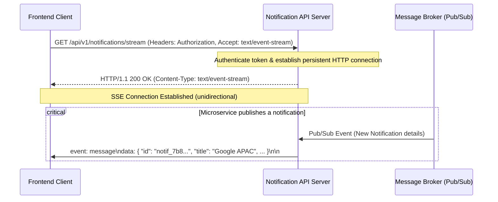

# Stage 1: Notification System API & Real-Time Design

This document details the REST API contract, JSON schema structures, and real-time delivery mechanism for the Notification Platform.

---

## 1. REST API Endpoints Overview

The API is structured around RESTful resources under version control (`/api/v1`). All responses follow a standardized envelope structure.

| Method | Endpoint | Description | Auth Required |
|:---|:---|:---|:---|
| **POST** | `/api/v1/notifications` | Send/publish a new notification to a specific user. | Yes |
| **GET** | `/api/v1/notifications` | Retrieve a list of notifications for the authenticated user. | Yes |
| **PATCH** | `/api/v1/notifications/:id/status` | Mark a specific notification as read or unread. | Yes |
| **DELETE** | `/api/v1/notifications/:id` | Dismiss/delete a notification. | Yes |

---

## 2. API Contracts & Specifications

### 2.1 Send Notification (`POST /api/v1/notifications`)
Used by internal systems and microservices to send a notification to a specific recipient.

#### Headers
```http
Content-Type: application/json
Authorization: Bearer <access_token>
```

#### JSON Request Body
```json
{
  "recipientId": "usr_94a7e2b1",
  "title": "Placement Drive: Google APAC 2026",
  "message": "Applications are now open for the Software Engineer role. Deadline: June 30.",
  "type": "Placement",
  "priority": "high",
  "metadata": {
    "jobId": "job_google_001",
    "applyUrl": "https://careers.google.com"
  }
}
```

#### JSON Response (Success - `201 Created`)
```json
{
  "success": true,
  "data": {
    "id": "notif_7b8c2d91",
    "recipientId": "usr_94a7e2b1",
    "title": "Placement Drive: Google APAC 2026",
    "message": "Applications are now open for the Software Engineer role. Deadline: June 30.",
    "type": "Placement",
    "priority": "high",
    "status": "unread",
    "metadata": {
      "jobId": "job_google_001",
      "applyUrl": "https://careers.google.com"
    },
    "timestamp": "2026-06-10T05:30:00Z"
  }
}
```

#### JSON Response (Error - `400 Bad Request`)
```json
{
  "success": false,
  "error": {
    "code": "VALIDATION_FAILED",
    "message": "Invalid fields present in the request body.",
    "details": [
      {
        "field": "type",
        "issue": "Must be one of: Placement, Result, Event"
      }
    ]
  }
}
```

---

### 2.2 Retrieve Notifications (`GET /api/v1/notifications`)
Retrieves notifications for the authenticated user. Supports filtering by notification type, read status, and cursor-based pagination.

#### Headers
```http
Accept: application/json
Authorization: Bearer <access_token>
```

#### Query Parameters
- `limit` (integer, default: 10): Number of notifications to return.
- `type` (string, optional): Filter by notification category (`Placement`, `Result`, `Event`).
- `status` (string, optional): Filter by status (`read`, `unread`).
- `cursor` (string, optional): Unique ID for pagination anchor.

#### JSON Response (Success - `200 OK`)
```json
{
  "success": true,
  "data": {
    "notifications": [
      {
        "id": "notif_7b8c2d91",
        "title": "Placement Drive: Google APAC 2026",
        "message": "Applications are now open for the Software Engineer role. Deadline: June 30.",
        "type": "Placement",
        "priority": "high",
        "status": "unread",
        "metadata": {
          "jobId": "job_google_001",
          "applyUrl": "https://careers.google.com"
        },
        "timestamp": "2026-06-10T05:30:00Z"
      }
    ],
    "pagination": {
      "limit": 1,
      "nextCursor": "notif_7b8c2d91",
      "hasMore": false
    }
  }
}
```

---

### 2.3 Update Notification Status (`PATCH /api/v1/notifications/:id/status`)
Updates the status of a specific notification (e.g., marking it as read).

#### Headers
```http
Content-Type: application/json
Authorization: Bearer <access_token>
```

#### JSON Request Body
```json
{
  "status": "read"
}
```

#### JSON Response (Success - `200 OK`)
```json
{
  "success": true,
  "data": {
    "id": "notif_7b8c2d91",
    "status": "read",
    "updatedAt": "2026-06-10T05:32:15Z"
  }
}
```

---

### 2.4 Delete Notification (`DELETE /api/v1/notifications/:id`)
Dismisses and permanently deletes a specific notification.

#### Headers
```http
Authorization: Bearer <access_token>
```

#### JSON Response (Success - `200 OK`)
```json
{
  "success": true,
  "message": "Notification successfully dismissed."
}
```

---

## 3. JSON Schemas & Validation

### 3.1 Notification Object Schema
```json
{
  "$schema": "https://json-schema.org/draft/2020-12/schema",
  "title": "Notification",
  "type": "object",
  "required": ["id", "recipientId", "title", "message", "type", "priority", "status", "timestamp"],
  "properties": {
    "id": {
      "type": "string",
      "description": "Unique identifier of the notification"
    },
    "recipientId": {
      "type": "string",
      "description": "Identifier of the target user"
    },
    "title": {
      "type": "string",
      "maxLength": 100,
      "description": "Short heading of the notification"
    },
    "message": {
      "type": "string",
      "maxLength": 1000,
      "description": "Main body text of the notification"
    },
    "type": {
      "type": "string",
      "enum": ["Placement", "Result", "Event"],
      "description": "Category of the notification"
    },
    "priority": {
      "type": "string",
      "enum": ["low", "medium", "high"],
      "description": "Urgency levels used for client rendering order"
    },
    "status": {
      "type": "string",
      "enum": ["read", "unread"],
      "description": "Current read status of the notification"
    },
    "metadata": {
      "type": "object",
      "description": "Dynamic structural payload containing extra links or contextual items"
    },
    "timestamp": {
      "type": "string",
      "format": "date-time",
      "description": "ISO 8601 UTC timestamp of creation"
    }
  }
}
```

---

## 4. Real-Time Notification Mechanism

To deliver real-time notifications to connected clients with high efficiency and minimal latency, the system utilizes **Server-Sent Events (SSE)**.



### 4.1 Server-Sent Events (SSE) Specification
Clients initiate a persistent connection through a standard HTTP request:

#### Request
```http
GET /api/v1/notifications/stream
Accept: text/event-stream
Cache-Control: no-cache
Connection: keep-alive
Authorization: Bearer <access_token>
```

#### Response Headers
```http
HTTP/1.1 200 OK
Content-Type: text/event-stream
Cache-Control: no-cache
Connection: keep-alive
Access-Control-Allow-Origin: *
```

#### Event Data Format
When a notification triggers, the server pushes a message over the connection:
```text
event: notification
data: {"id":"notif_7b8c2d91","title":"Placement Drive: Google APAC 2026","message":"Applications are now open.","type":"Placement","priority":"high","timestamp":"2026-06-10T05:30:00Z"}

event: heartbeat
data: {"time":"2026-06-10T05:31:00Z"}
```

### 4.2 Why Server-Sent Events (SSE) was Chosen Over WebSockets
1. **Unidirectional Simplicity**: Notifications flow purely from server-to-client. SSE is explicitly built for unidirectional streaming, avoiding the overhead of managing a full-duplex WebSocket connection.
2. **Standard HTTP Compatibility**: SSE operates over standard HTTP/HTTPS protocols, making it transparent to firewalls, API gateways, load balancers, and reverse proxies.
3. **Automatic Reconnection**: Browsers natively handle connection drops for SSE (`EventSource` API) and auto-reconnect with backoff. With WebSockets, this retry logic must be manually written.
4. **Multiplexing Support**: Over HTTP/2, SSE connections are multiplexed over a single TCP socket connection, mitigating the 6-connection browser limit per domain.

---

# Stage 2: Database Design, Schema, and Queries

This section describes the persistent storage strategy, database schema definition, scaling considerations, and implementation queries for the notification platform.

---

## 1. Database Selection & Justification

To store notifications reliably under high write volumes and varying query patterns, we recommend **PostgreSQL** (Relational Database) using **JSONB columns for unstructured metadata**.

### Why PostgreSQL with JSONB is Recommended:
1. **Hybrid Schema Flexibility (JSONB)**: Notifications often contain dynamic metadata depending on their type (e.g., `jobId` for Placements, `examId` for Results, `venue` for Events). PostgreSQL's `JSONB` data type allows storage of arbitrary schemas while supporting fast, indexable queries (using GIN indexes).
2. **ACID Compliance and Reliability**: Ensures notifications are never lost, and read status updates are fully consistent.
3. **Structured Relationships**: Easily enforces foreign key constraints (e.g., ensuring `recipient_id` matches a valid record in the `users` table).
4. **Rich Partitioning Features**: Built-in declarative partitioning enables seamless scaling as volume grows.

---

## 2. Database Schema (DDL)

Below is the DDL schema for PostgreSQL, including optimal indexing strategies for fast retrieval.

```sql
-- Enums for constrained fields
CREATE TYPE notification_type AS ENUM ('Placement', 'Result', 'Event');
CREATE TYPE notification_priority AS ENUM ('low', 'medium', 'high');
CREATE TYPE notification_status AS ENUM ('read', 'unread');

-- Notifications Table
CREATE TABLE notifications (
    id UUID PRIMARY KEY DEFAULT gen_random_uuid(),
    recipient_id VARCHAR(64) NOT NULL,
    title VARCHAR(100) NOT NULL,
    message TEXT NOT NULL,
    type notification_type NOT NULL,
    priority notification_priority NOT NULL DEFAULT 'low',
    status notification_status NOT NULL DEFAULT 'unread',
    metadata JSONB DEFAULT '{}'::jsonb,
    created_at TIMESTAMP WITH TIME ZONE DEFAULT CURRENT_TIMESTAMP,
    updated_at TIMESTAMP WITH TIME ZONE DEFAULT CURRENT_TIMESTAMP
);

-- Performance Optimization Indexes
-- 1. Index for loading a user's unread notifications feed sorted by latest first (Primary query pattern)
CREATE INDEX idx_notifications_recipient_status_created 
ON notifications (recipient_id, status, created_at DESC);

-- 2. Index for filtering notifications by category/type
CREATE INDEX idx_notifications_recipient_type_created 
ON notifications (recipient_id, type, created_at DESC);

-- 3. GIN index for deep querying keys inside the dynamic JSONB metadata
CREATE INDEX idx_notifications_metadata_gin 
ON notifications USING gin (metadata);
```

---

## 3. Scalability Challenges & Solutions

As data volume grows to millions or billions of rows, a standard database design will encounter bottleneck issues.

### 3.1 Anticipated Problems:
1. **Index Bloat in RAM**: As the table grows, the indices on `recipient_id` and `created_at` will exceed physical memory (RAM). Queries will trigger slow disk I/O instead of hitting RAM cache.
2. **Slow Table Scans**: Fetching notifications for a specific user requires scanning large B-Tree indices, which slows down as the index depth increases.
3. **Storage Exhaustion**: Retaining notifications indefinitely will consume massive disk space, most of which belongs to read/old notifications.
4. **Write Lock Contention**: A high volume of incoming notifications will compete for write locks on the primary database, slowing down message publishing.

### 3.2 Mitigation Solutions:
1. **Horizontal Partitioning (Sharding/Table Partitioning)**: 
   - **Range Partitioning by Time**: Partition the `notifications` table monthly (e.g., `notifications_2026_06`). Active reads and writes target the current month's partition, keeping the active index size small enough to fit inside RAM.
   - **Hash Partitioning by Recipient ID**: Partition by `recipient_id` hash, spreading the load across multiple physical tables.
2. **Data Archiving & Time-to-Live (TTL)**:
   - Notifications are transient and rarely viewed after 30-90 days. Implement a background worker or cron job to prune or archive notifications older than 90 days into cold storage (e.g., AWS S3, parquet formats) for long-term analytics.
3. **Caching Read Status (Write-Through/Cache-Aside)**:
   - Cache the unread notification counts per user in **Redis** (e.g., using a Redis Hash `user:unread_count`).
   - The frontend reads the badge count directly from Redis. Writes decrement or increment this key in Redis, saving costly database read queries.

---

## 4. REST API Implementation Queries

Below are the optimized SQL queries mapped to each REST API endpoint from Stage 1.

### 4.1 Create Notification (`POST /api/v1/notifications`)
Inserts a new notification record.
```sql
INSERT INTO notifications (recipient_id, title, message, type, priority, status, metadata)
VALUES (
    'usr_94a7e2b1', 
    'Placement Drive: Google APAC 2026', 
    'Applications are now open for the Software Engineer role. Deadline: June 30.', 
    'Placement', 
    'high', 
    'unread', 
    '{"jobId": "job_google_001", "applyUrl": "https://careers.google.com"}'::jsonb
)
RETURNING id, recipient_id, title, message, type, priority, status, metadata, created_at;
```

### 4.2 Fetch Notifications with Filters and Cursor Pagination (`GET /api/v1/notifications`)
Retrieves notifications utilizing pagination and query filters. Uses keyset pagination (cursor) on `created_at` or `id` to prevent slow `OFFSET` page scans.

**SQL Query (Example: Fetching latest 10 unread "Placement" notifications for user `usr_94a7e2b1` after cursor timestamp):**
```sql
SELECT id, title, message, type, priority, status, metadata, created_at
FROM notifications
WHERE recipient_id = 'usr_94a7e2b1'
  AND type = 'Placement' -- Optional type filter
  AND status = 'unread'   -- Optional status filter
  AND created_at < '2026-06-10T05:30:00Z' -- Keyset pagination cursor anchor (timestamp)
ORDER BY created_at DESC, id DESC
LIMIT 10;
```

### 4.3 Update Notification Status (`PATCH /api/v1/notifications/:id/status`)
Updates the read/unread status of a notification for a user.
```sql
UPDATE notifications
SET status = 'read',
    updated_at = CURRENT_TIMESTAMP
WHERE id = 'notif_7b8c2d91'
RETURNING id, status, updated_at;
```

### 4.4 Delete Notification (`DELETE /api/v1/notifications/:id`)
Permanently dismisses a notification.
```sql
DELETE FROM notifications
WHERE id = 'notif_7b8c2d91';
```

